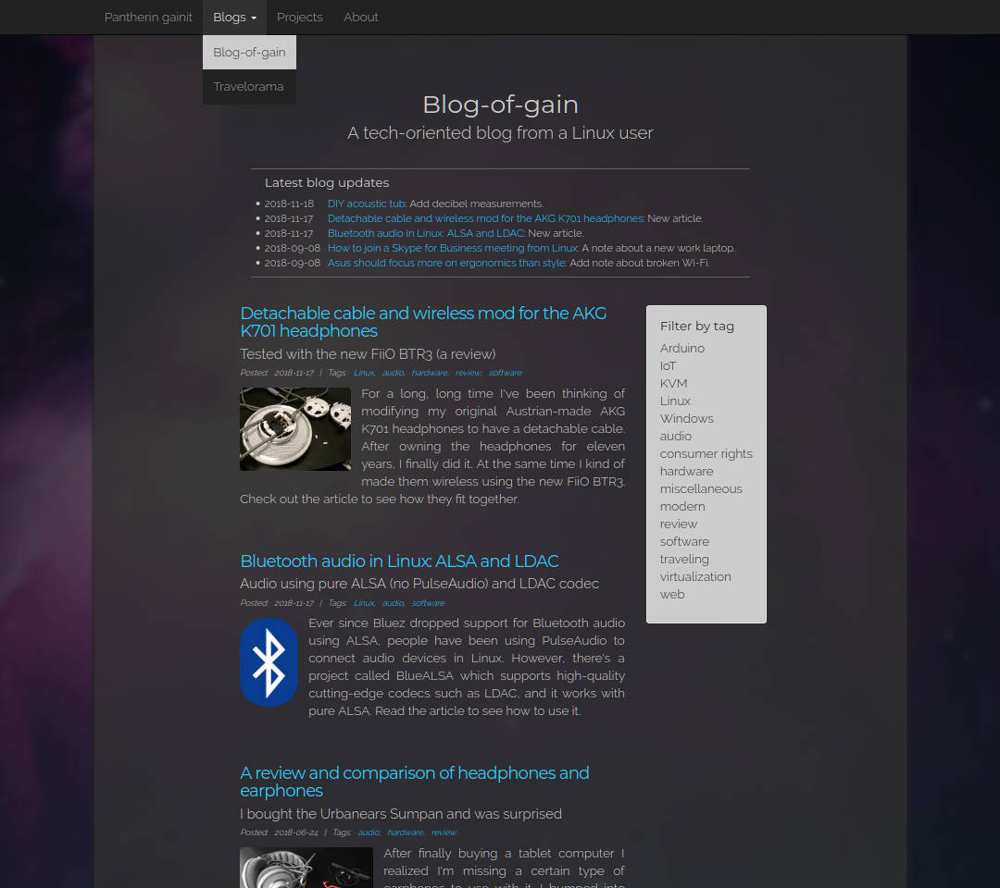

# GainCMS

GainCMS is a simple PHP blog engine for generic websites and blogs, influenced by Jekyll and Grav which are close but not as simple and effective as this. If all you need is a quick and simple CMS/blog with pagination and comments supports or a simple responsive web site, this might be a good base. Not by any means "user-friendly" in the modern dummy end user sense, if you have some dev skills or experience with CLI, GainCMS should be trivial to use and takes only a few minutes to get into.

## Feature list

* Simple and easy to modify
* Flat file blog CMS
* Responsive design (Bootstrap)
* Markdown articles (Parsedown)
* Disqus comments
* Pagination
* Tagging
* PHP routing
* Multiple blog support
* Simple visitor statistics

Sample screenshot from the original author's blog:


## Requirements and installation

Required software:

* Either **Apache** or **nginx**:
    * Apache 2.2.16 or newer with rewrite module.
    * nginx 1.10 tested, probably works also with earlier versions.
* **PHP** 4.3 or newer.
* For statistics parsing (optional), Python 3 is required.

To get things running:

1. Install required software. Refer to [Web server configuration](#web-server-configuration) below for more instructions.
2. Copy the contents of the repository into your web server root directory (e.g. */var/www*).
3. Configure the `CONFIG_URL_BASE` variable (and optionally the `CONFIG_GITHUB_USER` and `CONFIG_URL_DISQUS` variables) in *index.php*.

The site should now work correctly. Check file permissions if you get any errors.

## Structure explained

Below is a rough example diagram of GainCMS structure, where + denotes a directory and - denotes a file. The first line of the diagram is the root directory.

```
+ /
 \
 |- .htaccess
 |- index.php
 |+ site/
   \
   |- about.php
   |- blog.php
   |- error.php
   |- home.php
   |- post.php
   |- projects.php
   |+ css/
   |+ files/
   |+ graphics/
   |+ includes/
   |
   |+ posts/
     \
     |+ 2015-08-26_example/
     | \
     | |- article.md
     | |- intro.md
     | |- tag_software
     | |- tag_spaces work too
     | |- tag_but_are_converted_anyway
     | |- thumb_woot.jpg
     | |- woot.jpg
     |+ _2015-11_26_unpublished/
       \
       |- article.md

    etc.

```

The *index.php* contains the site configuration and works as a router. It breaks down the URL and shows the correct page (*about.php*, *blog.php* etc.). All requests are directed to *index.php* in *.htaccess*. Adding and removing subpages is therefore straightforward and there's no magic involved. Basically one can write a new page from scratch and it will be shown just like that. The configuration of blogs is also defined here.

In the *includes* directory there are the common header (which also contains the navigation bar) and footer along with other utilities (e.g. a Parsedown extension). The *css*, *graphics* and *files* directories contain the style definitions, images and icons, and various other files respectively.

Blog articles go to directories configured in *index.php*, by default to *posts*. Every article is contained in its own subdirectory, whose name must begin with a date in the `YYYY-MM-DD` format, with the exception of unpublished articles. Their directories begin with an underscore by default. The directory name of an article is also used as the ID for Disqus comments.

## Articles

Each blog article consists of the article itself in *article.md*, a short intro in *intro.md* (which is shown in the blog post listing and social media shares), tags, and other files such as images if referred to in the article. The tags are just empty files whose names should begin with `tag_` by default. Spaces in tags are supported, but underscores are converted to spaces anyway in hyperlinks.

The paths and glob patterns are customizable in *index.php*.

There are two special tags to roughly control the layout of the pictures within the article:
* `<br>` inside an article paragraph will perform a clear for floating images.
* Emphasis using asterisks around an image will make the image full width. In Markdown, you would write `*[](thumb.jpg)*`. This is useful for impressive panorama images.

## Visitor statistics

GainCMS has its own simple visitor statistics support so as not to give too much information to big corporations. To enable the visitor statistic, simply create the directory *DIR_STATS_BASE*, defined in *index.php*. Statistics may be parsed with the Python script *parse_stats.py*. You may also ignore IP addresses from the statistics: see `CONFIG_STATS_IP_IGNORE_FILE` in *index.php*. List one IP per line in the file. The addresses mentioned there won't be logged.

## Web server configuration

### Apache

Enable the rewrite module and PHP, either by module or php-fpm.

### nginx

The commands shown here must be run with elevated privileges (root).

* For secure installation, it is generally recommended to create a new user and a group for the site:
```
groupadd gaincms
useradd -g gaincms gaincms
```
* Create the php-fpm pool config */etc/php/7.0/fpm/pool.d/gaincms.conf* (location may vary):
```
[gaincms]
user = gaincms
group = gaincms
listen = /run/php/php7.0-fpm-gaincms.sock
listen.owner = www-data
listen.group = www-data
pm = dynamic
pm.max_children = 5
pm.start_servers = 2
pm.min_spare_servers = 1
pm.max_spare_servers = 3
chdir = /
php_admin_value[disable_functions] = allow_url_fopen, exec, passthru, popen, proc_open, shell_exec, show_source, system
```
* Create the nginx site */etc/nginx/sites-available/gaincms*:
```
server {
    listen 80 default_server;
    listen [::]:80 default_server;
    root /var/www;
    index index.php;
    autoindex off;
    server_name 10.0.1.2;

    location / {
        try_files $uri /index.php$is_args$args;
    }

    location ~ ^/index\.php(/|$) {
        include snippets/fastcgi-php.conf;
        fastcgi_pass unix:/run/php/php7.0-fpm-gaincms.sock;

        fastcgi_split_path_info ^(.+\.php)(/.*)$;
        include fastcgi_params;
        fastcgi_param SCRIPT_FILENAME $document_root$fastcgi_script_name;
        fastcgi_param HTTPS off;

        internal;
    }

    location ~ /\.ht {
        deny all;
    }
}
```
* Edit the `server_name` to something more reasonable, set `root` to your web server root directory, and enable the site by symlinking:
```
ln -s /etc/nginx/sites-available/gaincms /etc/nginx/sites-enabled/
```
* Finally, restart the *php-fpm* and *nginx* services; e.g. for System V init scripts:
```
service php7.0-fpm restart
service nginx restart
```

## Project goals by the original author

I made this CMS to have a simple yet flexible platform to write about things I've wanted to share. Some of these are for a very small audience (Linux audio for example), and some are just for my personal fun. Professionally, I wanted to have some experience on modern responsive web design. This CMS uses Bootstrap along with custom styles (e.g. responsive YouTube-video containers). I also wanted to see how routing works in practice.

## License

GainCMS is released under the terms of the [GNU General Public License v3](http://www.gnu.org/licenses/gpl-3.0.txt). GainCMS uses Parsedown and Bootstrap, which are [MIT](http://opensource.org/licenses/MIT) licensed. The social media share icons are [CC](https://creativecommons.org/licenses/by/3.0/) by [Aha-Soft Team](http://www.aha-soft.com/free-icons/). By default all the articles published with GainCMS have the [Creative Commons Attribution 4.0 International License](http://creativecommons.org/licenses/by/4.0/). Edit the file *post.php* to change that.
